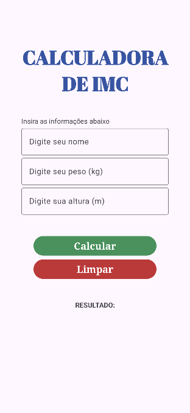

<h1>Calculadora de IMC</h1>

<h2>FECAP - Ciência da Computação - 2024/2</h2>

<strong>Programação de Dispositivos Móveis - Prof. Vinicius Heltai</strong>

<h3>Primeiro Projeto - NI 1</h3>

  

<h2>Integrantes do Grupo</h2>
<ul>
  <li><strong>Jenifer Barreto</strong> - Matrícula: 23025664</li>
  <li><strong>Maria Eduarda de Freitas Lopes</strong> - Matrícula: 23025447</li>
  <li><strong>Sabrinna Vicente</strong> - Matrícula: 23025550</li>
  <li><strong>Beatriz de Souza</strong> - Matrícula: 23025365</li>
</ul>

<h2>Descrição do Projeto</h2>

Este projeto consiste em uma aplicação Android de calculadora de Índice de Massa Corporal (IMC). O objetivo é implementar novas funcionalidades seguindo os conceitos aprendidos na disciplina.

<h3>Funcionalidades Implementadas</h3>
<ul>
  <li><strong>Tela de Login</strong>: O usuário deve fazer login antes de acessar a calculadora de IMC.</li>
  <li><strong>Entrada de Dados</strong>: O usuário pode inserir altura e peso para calcular o IMC.</li>
  <li><strong>Cálculo de IMC</strong>: O aplicativo calcula o IMC do usuário com base nos dados inseridos.</li>
  <li><strong>Classificação do IMC</strong>:
    <ul>
      <li>Abaixo do Peso</li>
      <li>Peso Normal</li>
      <li>Sobrepeso</li>
    </ul>
  </li>
  <li><strong>Tela de Resultado</strong>: Cada classificação de IMC é exibida em uma nova tela (Activity), com orientações específicas para o usuário, incluindo dicas de saúde e informações adicionais.</li>
  <li><strong>Navegação</strong>: As telas de resultado possuem um botão que permite retornar à tela anterior.</li>
</ul>

<h2>Instruções de Uso</h2>
<ol>
  <li><strong>Clone o Repositório</strong>:
    <pre>
      <code>git clone https://github.com/seu-usuario/nome-do-repositorio.git</code>
    </pre>
  </li>
  <li><strong>Instale o APK</strong> no seu dispositivo Android ou utilize um emulador.</li>
  <li><strong>Abra o aplicativo</strong> e faça login com suas credenciais.</li>
  <li><strong>Insira os dados</strong> de altura e peso para calcular o IMC.</li>
  <li><strong>Navegue</strong> entre as telas para verificar sua classificação de IMC e orientações.</li>
</ol>

<h2>Tecnologias Utilizadas</h2>
<ul>
  <li><strong>Linguagem</strong>: Java</li>
  <li><strong>IDE</strong>: Android Studio</li>
  <li><strong>SDK</strong>: Android SDK 33</li>
</ul>

<h2>Licença</h2>

Este projeto é apenas para fins educacionais e não possui uma licença específica.

